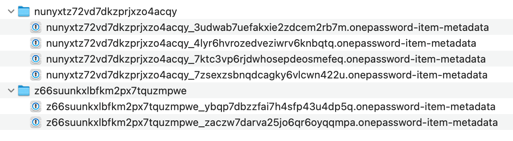

# 1Password Bookmarks

Several great utilities like [Alfred](https://www.alfredapp.com), [Keyboard Maestro](https://www.keyboardmaestro.com/main/), [LaunchBar](https://www.obdev.at/products/launchbar/index.html), and [Raycast](https://www.raycast.com) integrate with 1Password for Mac to provide 1Click Bookmarks[^1][^2][^3].

These integrations were powered by plain-text metadata that 1Password 7 users could opt-in to creating. This metadata was also indexed and searchable using Spotlight.

1Password 8 supports a new CLI that provides a secure and more feature-rich option for 3rd parties to integrate with.

This project uses the 1Password CLI to generate the identical metadata files to preserve functionality until apps have a chance use the CLI directly.


## Building

For the time being there is no downloadable installation available. Instead, you will need to clone this repo and build it.

Built and tested with [Rust](https://www.rust-lang.org) 1.59.0.

- `git clone`
- `cd opbookmarks`
- `cargo build --release`

The built executable can be found in `target/release/opbookmarks`.

## Usage

You will need [1Password 8](http://1password.com/downloads/mac/#beta-downloads) as well as the [1Password CLI](https://developer.1password.com/docs/cli) installed.

```
USAGE:
    opbookmarks [OPTIONS] <EXPORT_PATH> [ACCOUNTS]...

ARGS:
    <EXPORT_PATH>    The path to export the metadata files to. To use the same path that
                     1Password 7 used, specify
                     ~/Library/Containers/com.agilebits.onepassword7/Data/Library/Caches/Metadata/1Password
    <ACCOUNTS>...    Account user UUIDs to generate metadata for. Defaults to all accounts. Use
                     spaces to separate multiple accounts. UUIDs can be found using `op account
                     list`

OPTIONS:
    -h, --help                       Print help information
    -w, --watch-path <WATCH_PATH>    The path to the 1Password 8 database file to watch. Typically
                                     ~/Library/Group\
                                     Containers/2BUA8C4S2C.com.1password/Library/Application\
                                     Support/1Password/Data
```

Use `--watch-path` to monitor the 1Password 8 data folder for changes. This uses the FSEvents API provided by Apple which is efficient enough to leave running in the background indefinitely.

Use `nohup` and append `&` to the above command to allow it to run even after the Terminal window is closed. For example to watch a single account indefinitely, even after the Terminal window is closed:

`nohup cargo run $EXPORT_DIR --watch-path $OP8_DATA_DIR BXRGOJ2Z5JB4RMA7FUYUURELUE &`

## History

In 1Password 7 users could enable Preferences > Advanced > Enable Spotlight and 3rd party app integrations. Doing so would create files like these within `~/Library/Containers/com.agilebits.onepassword7/Data/Library/Caches/Metadata/1Password`:



Each of these were json files with these fields:

```
{
  "uuid": "7ktc3vp6rjdwhosepdeosmefeq",
  "itemDescription": "Login from Papa🐻",
  "itemTitle": "Evernote personal",
  "vaultName": "Papa🐻",
  "vaultUUID": "nunyxtz72vd7dkzprjxzo4acqy",
  "categoryPluralName": "Logins",
  "modifiedAt": 1611606417,
  "profileUUID": "nunyxtz72vd7dkzprjxzo4acqy",
  "websiteURLs": ["https://www.evernote.com/Registration.action"],
  "categorySingularName": "Login",
  "categoryUUID": "001",
  "accountName": "Teare 👨‍👩‍👧‍👦 Fam",
  "createdAt": 1520813775
}
```

## Tighter integration

The CLI can do a lot more than is possible with plain text metadata files. Things like usernames could be included alongside the titles in item lists, items can be created within 1Password, and in theory the entire 1Password experience could be recreated.

This new approach would no longer rely on unprotected plain text files, and with the new CLI users can authorize access using Touch ID or their Apple Watch to individual accounts.

There are innumerable possibilities as `op` is a full-featured CLI that supports CRUD of items, vaults, and even accounts.

I'm looking forward to exploring all the possibilities this unlocks! 😍 And I'm happy to help. The best way to reach me is [@dteare](https://twitter.com/dteare) on Twitter. 🤗

[^1]: [Alfred+1Password integration](https://www.alfredapp.com/help/features/1password/)
[^2]: [LaunchBar+1Password features](https://www.obdev.at/products/launchbar/features.html)
[^3]: [Raycast 1Password extension](https://www.raycast.com/khasbilegt/1password7)
