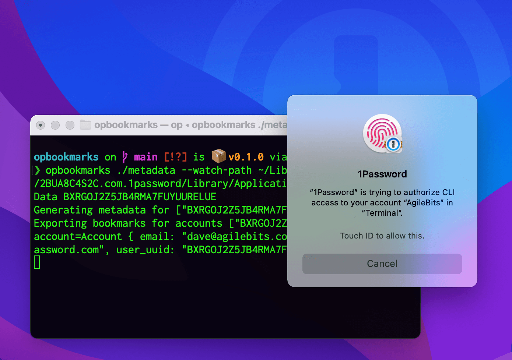
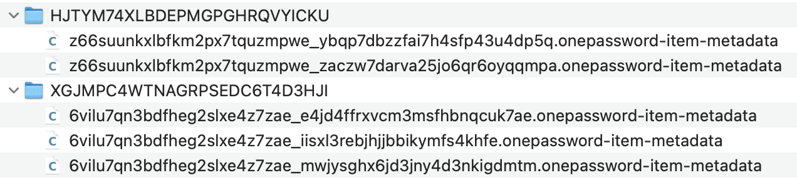

# 1Password Bookmarks

Several great utilities like [Alfred](https://www.alfredapp.com), [Keyboard Maestro](https://www.keyboardmaestro.com/main/), [LaunchBar](https://www.obdev.at/products/launchbar/index.html), and [Raycast](https://www.raycast.com) integrate with 1Password for Mac[^1][^2][^3].

These integrations were historically powered by plain-text metadata that 1Password users could opt-in to creating. 1Password 8 supports a new CLI that provides a secure and more feature-rich option for 3rd parties to integrate with.

This project uses the 1Password CLI to generate the identical metadata files to preserve functionality until apps have a chance use the CLI directly.



## Build & install

To build from source you'll need [Rust](https://www.rust-lang.org) (at least 1.59.0).

- `git clone`
- `cd opbookmarks`
- `cargo build --release`

The built executable can be found in `target/release/opbookmarks`.

You can find pre-built executables on the [releases page](https://github.com/dteare/opbookmarks/releases). To use these you will need to manually chmod u+x and remove the quarentine bit to make it work.

## Usage

You will need [1Password 8](http://1password.com/downloads/mac/#beta-downloads) as well as the [1Password CLI](https://developer.1password.com/docs/cli) installed.

```
USAGE:
    opbookmarks [OPTIONS] [ACCOUNTS]...

ARGS:
    <ACCOUNTS>...    Account user UUIDs to generate metadata for. Leave empty to export
                     bookmarks for all accounts. Use spaces to separate multiple accounts. UUIDs
                     can be found using `op account list`

OPTIONS:
    -e, --export-path <EXPORT_PATH>    The path to export the metadata files to. Defaults to
                                       ~/.config/op/bookmarks.
    -h, --help                         Print help information
    -w, --watch                        Watch the 1Password data folder for changes
        --watch-path <WATCH_PATH>      The path to the 1Password 8 database folder to watch.
                                       Defaults to ~/Library/Group\
                                       Containers/2BUA8C4S2C.com.1password/Library/Application\
                                       Support/1Password/Data
```

## Monitor for changes

If you'd like to automatically trigger `opbookmarks` after a change you can use `--watch-path` to monitor the 1Password 8 data folder. This uses the FSEvents API provided by Apple which is efficient enough to leave running in the background indefinitely.

Use `nohup` and append `&` to the above command to allow it to run even after the Terminal window is closed. For example, to watch a single account indefinitely, even after the Terminal window is closed:

`nohup opbookmarks BXRGOJ2Z5JB4RMA7FUYUURELUE &`

## App integration

You can add support for 1Password bookmarks to your app by following these steps:

1. Load item metadata from `~/.config/op/bookmarks`. See `Item metadata` section for details.
2. To view an item in 1Password launch `onepassword://view-item/?a=${item.profileUUID}&v=${item.vaultUUID}&i=${item.uuid}`.
3. To open an item in 1Password for editing launch `onepassword://edit-item/?a=${item.profileUUID}&v=${item.vaultUUID}&i=${item.uuid}`.
4. For items with websites, open a browser and 1Password in your browser will show the fill options in the inline menu. In the future a url handler will be provided for automatic Open&Fill support.

A working example can be seen in the [1Password 8 Raycast extension](https://github.com/dteare/raycast-1password-extension). The primary code is in [list.tsx](https://github.com/dteare/raycast-1password-extension/blob/main/src/list.tsx).

If your app already has support for 1Password 7, during the transition period you could fall back to the old approach if `~/.config/op/bookmarks` isn't found. I.e. load item metadata from `~/Library/Containers/com.agilebits.onepassword7/Data/Library/Caches/Metadata/1Password` and use the 1Password 7 url handlers.

## Tighter integration

The CLI can do a lot more than is possible with plain text metadata files. Things like usernames could be included alongside the titles in item lists, items can be created within 1Password, and in theory the entire 1Password experience could be recreated and more.

With this approach there would be no need to rely on unprotected plain text files, and with the new CLI users can authorize access using Touch ID or their Apple Watch to individual accounts. There are innumerable possibilities as `op` is a full-featured CLI that supports CRUD of items, vaults, and even accounts.

I'm looking forward to seeing all the possibilities the CLI unlocks! 😍 And the team and I are happy to help. The best way to reach me is [@dteare](https://twitter.com/dteare) on Twitter. 🤗

## Item metadata

Here's how the item metadata files are structured in `./config/op/bookmarks`:



The folder is the account/profile UUID and each of these files contain json with these fields:

```
{
  "uuid": "7ktc3vp6rjdwhosepdeosmefeq",
  "itemDescription": "Login from Papa🐻",
  "itemTitle": "Evernote personal",
  "vaultName": "Papa🐻",
  "vaultUUID": "nunyxtz72vd7dkzprjxzo4acqy",
  "categoryPluralName": "Logins",
  "modifiedAt": 1611606417,
  "profileUUID": "nunyxtz72vd7dkzprjxzo4acqy",
  "websiteURLs": ["https://www.evernote.com/Registration.action"],
  "categorySingularName": "Login",
  "categoryUUID": "001",
  "accountName": "Teare 👨‍👩‍👧‍👦 Fam",
  "createdAt": 1520813775
}
```

## Performance

There are multiple caches at play that will greatly affect performance. Here's some numbers you can expect to see for a single account with 7 vaults containing 62 items.

**Typical sync w/ warm op cache, no items changed: 1.9s**

```
opbookmarks on  main is 📦 v0.1.0 via 🦀 v1.60.0-nightly took 7s
❯ time cargo run BXRGOJ2Z5JB4RMA7FUYUURELUE
Will create bookmark metadata for account user uuids ["BXRGOJ2Z5JB4RMA7FUYUURELUE"]...
Exporting bookmarks for accounts ["XGJMPC4WTNAGRPSEDC6T4D3HJI"]
0 metadata files written to "/Users/dave/.config/op/bookmarks".
cargo run BXRGOJ2Z5JB4RMA7FUYUURELUE  0.30s user 0.09s system 20% cpu 1.921 total
```

**Typical sync w/ warm op cache, one item changed: 6.4s**

```
❯ time cargo run BXRGOJ2Z5JB4RMA7FUYUURELUE
Will create bookmark metadata for account user uuids ["BXRGOJ2Z5JB4RMA7FUYUURELUE"]...
Exporting bookmarks for accounts ["XGJMPC4WTNAGRPSEDC6T4D3HJI"]
1 metadata files written to "/Users/dave/.config/op/bookmarks".
cargo run BXRGOJ2Z5JB4RMA7FUYUURELUE  0.87s user 0.23s system 16% cpu 6.434 total
```

**Full sync w/ warm op cache: 7.5s**

```
❯ time cargo run BXRGOJ2Z5JB4RMA7FUYUURELUE
Will create bookmark metadata for account user uuids ["BXRGOJ2Z5JB4RMA7FUYUURELUE"]...
Exporting bookmarks for accounts ["XGJMPC4WTNAGRPSEDC6T4D3HJI"]
62 metadata files written to "/Users/dave/.config/op/bookmarks".
cargo run BXRGOJ2Z5JB4RMA7FUYUURELUE  1.23s user 0.37s system 21% cpu 7.505 total
```

**Initial sync, all caches completely cold: 16.5s**

```
❯ time cargo run BXRGOJ2Z5JB4RMA7FUYUURELUE
Will create bookmark metadata for account user uuids ["BXRGOJ2Z5JB4RMA7FUYUURELUE"]...
Exporting bookmarks for accounts ["XGJMPC4WTNAGRPSEDC6T4D3HJI"]
62 metadata files written to "/Users/dave/.config/op/bookmarks".
cargo run BXRGOJ2Z5JB4RMA7FUYUURELUE  1.74s user 0.59s system 14% cpu 16.491 total
```

[^1]: [Alfred+1Password 7 integration](https://www.alfredapp.com/help/features/1password/)
[^2]: [LaunchBar+1Password 7 features](https://www.obdev.at/products/launchbar/features.html)
[^3]: [Raycast 1Password 7 extension](https://www.raycast.com/khasbilegt/1password7)
